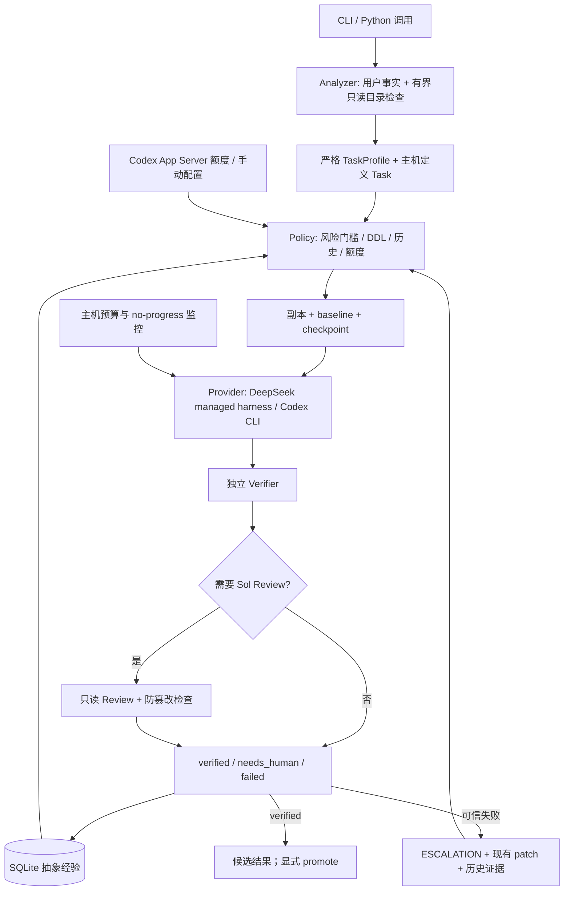

# 架构与实现交付

## 1. 原项目检查结论

2026-09-09 检查当前目录：空目录，无源码、配置、VCS、AGENTS.md 或已有 Harness。可用环境：Python 3.12.7、Git、Codex CLI 0.153.4；没有 DeepSeek 可执行程序。后续用户提供临时 API Key，真实 `/models` 接口确认 `deepseek-v4-pro` 可用。

原来的 Prompt 入口、模型调用、工具执行、session、配置、日志、provider abstraction 均不存在。最小侵入方案是增加可独立使用的 Python 包，对原工程默认只读，执行在副本中。没有更换用户项目的版本管理。

## 2. 新架构



分析与策略不改生产文件。每次执行有独立 run ID；每轮 prompt、route、verification、checkpoint 保存在 run 目录。升级启用新执行上下文，继续同一候选目录；不携带整个聊天历史。

## 3. 文件职责

| 文件 | 职责 |
|---|---|
| `model_router/models.py` | Task/Profile/Model/Budget/Event/Outcome 类型与校验 |
| `analyzer.py` | LLM 客观特征提取、引用检查、保守离线模式、覆盖命令 |
| `policy.py` | 风险门槛、候选成本、历史过滤、额度及 deadline |
| `config.py` / `router.example.toml` | 类型化配置、模型目录、provider 和主机检查 |
| `providers.py` / `api_worker.py` | DeepSeek 受控工具循环、Codex JSONL、可终止 HTTP worker |
| `process.py` | 有界 stdout/stderr、进程组终止、超时、无 shell 插值 |
| `monitor.py` | 时间、探索、失败测试、上下文、重复行为检测 |
| `workspace.py` | 副本、VCS 识别、路径限制、快照、diff、显式推广与失败恢复 |
| `verifier.py` | 主机定义检查、文件范围、预期修改、人工验收状态 |
| `handoff.py` | 紧凑执行 Prompt 和分节限长交接 |
| `experience.py` | SQLite WAL、抽象结果统计、小样本平滑 |
| `usage.py` | 官方 App Server 初始化和额度读取 |
| `orchestrator.py` | 有限状态执行循环、review、升级、结果落盘 |
| `cli.py` / `__main__.py` | analyze / plan / run / doctor / usage / history / promote |
| `tests/` | 策略、预算、隔离、验证、升级、provider 合同测试 |
| `examples/` | 真实 smoke、小型目标工程、JSON Task、显式离线 fixture |

## 4. 配置

`Config.load()` 读取 TOML；相对 state 路径以配置文件位置解析。配置中的资源费用是**效用单位，不是官方美元价格或实际订阅额度消耗**。未知实际 API 成本/额度消耗以 NULL 保存，不填 0。

默认逻辑目录：

| id | rank | provider | model | reasoning |
|---|---:|---|---|---|
| deepseek | 0 | deepseek | deepseek-v4-pro | 由 provider thinking 设置控制 |
| sol_medium | 2 | codex | gpt-5.6-sol | medium |
| sol_high | 3 | codex | gpt-5.6-sol | high |
| astra | 4 | codex | gpt-6-astra | high |
| astra_ultra | 5 | codex | gpt-6-astra | ultra |

Tier 1 是 rank 0 执行 + Sol review 的组合路径，不假装存在第六种基础模型。

`thinking="disabled"` 是示例 DeepSeek 默认值，适用于明确工程操作。可配置 `thinking="enabled"`、`reasoning_effort="low"/"high"/"max"`；分析阶段独立关闭 thinking，避免简单事实提取长时间推理。开启推理时需相应提高 `max_output_tokens`，所有时间/上下文限制仍生效。

`[commands]` 中每个值必须为 argv 数组，例如 `unit=["python","-B","-m","unittest","discover","-s","tests"]`。这些是**用户信任的主机命令**，不要配置危险脚本；不向模型暴露任意 shell 工具。配置、测试脚本、运行产物属于本地主机信任边界。

`[budgets.default]` → `[budgets.MODEL_ID]` → `[budgets.TASK_TYPE]` 按顺序覆盖。随后 DDL 可继续收紧预算，不能被宽松配置延长。

## 5. Provider 与模型扩展

兼容 Chat Completions 的供应商可直接新增 `[providers.vendor]`，设置 `kind="managed_chat"`、`base_url`、`api_key_env`，再添加模型。不要把兼容协议当成真实模型可用性保证。

`[[models]]` 一旦出现便替换整个模型目录；每条包括 `id/provider/model/reasoning/rank/resource_cost/prior_success/expected_minutes/scarce`。例：

```toml
[providers.local]
kind = "managed_chat"
base_url = "http://127.0.0.1:8000/v1"
api_key_env = "LOCAL_MODEL_KEY"

[[models]]
id = "local_coder"
provider = "local"
model = "your-confirmed-model-id"
reasoning = ""
rank = 0
resource_cost = 0.1
prior_success = 0.8
expected_minutes = 12
scarce = false
```

使用组合 review 时需保留 `sol_medium` reviewer 条目；slash 别名保持 DeepSeek/Sol/Astra 的用户约定。增加不兼容 API 或现有外部 Harness：实现 `run(task, model, prompt, work, monitor, emit, review=False)`，注册到 `providers.PROVIDERS` 或向 `Orchestrator(provider_factory=...)` 注入。适配器必须在阻塞等待时检查 `monitor`，并确保取消后无残留进程。未知 adapter 会显式报错，不伪造成功。

可以注入 `Verifier` 和 `on_route` 回调接入现有 UI/服务；第一版没有 Web UI、任务队列或外部 Harness 专用驱动。

## 6. 路由评分与门槛

先建立风险指标：

```text
risk = 1.5*blast + tool + scope + 1.5*domain_uncertainty
     + 2*root_uncertainty + (5-clarity) + (5-verifiability) + (5-reversibility)
```

门槛包括：根因未知的 debug/性能/逆向至少 Sol High；工业私有行为不明至少 Sol High；理论研究/架构至少 Sol High；自动验证极低至少 Sol High；较大跨模块范围至少 Sol Medium；高综合风险至少 Sol High。

正式 feature/refactor 且 DDL <24h 至少 Sol Medium，未知根因提升到 Sol High。生产 blocker <4h 至少 Sol High（明确、可验证机械操作除外）。现场/不足1h的复杂 blocker至少 Astra。critical至少 Sol High，允许 Ultra 候选。低额度仅增加机会成本，不降低这些门槛。

Ultra 只有 Astra 已失败、显式 `/ultra`、critical、极紧 DDL 且高影响，或极高价值复杂 blocker 才能成为候选；允许并不等于一定选它。

需求明确、可验证、可恢复的正式工程，若影响/范围/review成本较高，可用 DeepSeek + Sol Review。review 成本初值按完整执行的 35% 估计，残余错误风险按 50% 估计；是**待校准的策略假设**，不是测得成功率，也不假设两个模型错误独立。相应配置为 `review_cost_fraction`、`review_residual_risk`。

合格候选的预期成本近似：

```text
resource_cost * scarcity + review_cost
+ time_weight * (execution_minutes + review_minutes) * urgency
+ (1-adjusted_success) * (
      execution_minutes * urgency
    + human_cost * human_weight
    + blast_radius * failure_weight * residual_risk)
```

`urgency` 为普通1、<24h为2、<4h为4。额度剩余 >70 / 40–70 / 20–40 / <20 时稀缺成本乘数为1 / 1.5 / 3 / 6；关键 blocker 或紧急正式工程最高按1.5，`/cheap` 再加倍。Review 的稀缺成本同样计入。

历史检索使用领域、任务类型、环境、逻辑模型、实际模型、provider、reasoning、策略完全匹配。平滑率 `(successes + 4*prior)/(attempts + 4)` 随样本增长由事实主导。达到最小样本5次后，正式项目平滑率<85%、其他项目<65%会排除该候选。基础设施错误和未完成的人工验收不计入能力成功率。历史只改变安全门槛之上的选择，不推翻明确的 critical/DDL 约束。

初始成功率与耗时都是明示先验，不能当成测量结论。`suggested_executor` 和模型自评 confidence 不参与策略。

## 7. 预算、升级与交接

- 默认 DeepSeek：10分钟、30探索步、2次失败测试、2 debug rounds、10次无新增证据工具调用、64KB上下文增长。
- 高档位：通常15分钟、45探索步、96KB；DDL 可收紧。任务整体默认40分钟、最多5次尝试。
- 上下文单位是 UTF-8 字节，不等同实际 tokens。命令输出、HTTP响应、事件队列另有限制。
- 检查失败、预算耗尽、无进展均是可信失败。DeepSeek失败下一档至少 Sol Medium；之后 Sol High → Astra → Ultra，始终保持单调升级。
- 重复动作签名、重复结果哈希、文件 A→B→A、无新证据的 hypothesis 可提前停止。连续失败测试在 managed tools 中是精确事件；Codex CLI 的内部工具可观测性较粗，依靠命令事件、文件哈希、独立 verifier 和运行时兜底。
- HTTP请求在子进程运行，避免只用 socket timeout 而被持续缓慢响应拖住。进程无输出也受主机墙钟限制；Windows 终止整个 PID tree，POSIX 终止 process group。
- 环境错误、凭据缺失、沙箱拒绝停止为 blocked，不把升级模型当成修复环境的方法。
- 未能自动验收返回 needs_human，不虚报成功，不因缺人工证据无限升级。

交接包含用户请求、profile、目标、读写文件、命令、检查、观察结果、事实、已测试/排除假设、当前失败、问题、下一步、限制、diff摘要。每节独立限长，避免后面的关键失败信息被前面日志挤掉。保留每轮 `handoff-N.md` 及最新 `ESCALATION.md`。执行器提供的事实/假设明确标记 provenance，不伪装成主机观测。缺少遥测的章节保持空而不编造。

## 8. Workspace / Verifier

副本支持 Git、SVN、Hg、无VCS，保留源工作区当前未提交文件。排除 VCS元数据、依赖缓存、`.env*`；100MB/10000文件上限；拒绝 symlink/junction。候选保留修改，baseline/每轮checkpoint提供恢复依据。不是自动 cherry-pick，第一版不提供 Git worktree 优化。

Verifier 运行**主机事先定义**的 argv，再检查变化范围、禁止文件、预期修改及保留目录。测试脚本可能有副作用，因此检查发生在执行测试之后。缺少检查/验收标准或需要实际现场验收时结果是 needs_human。

候选 verified 后仍不会自动进入正式状态。`promote` 再验证源哈希和已验收候选哈希，拒绝源工作区漂移、候选漂移。复制过程中发生可捕获错误会恢复已触及文件的 baseline；不是跨文件操作系统事务，也不承诺断电原子性。源目录应在推广期间保持静止；并发改写/恶意竞态不在本地 MVP 保证范围内。

Managed Harness 不暴露任意 shell。Codex CLI 自主管理的 shell 依赖官方 OS 沙箱，执行目录限制和独立 diff 校验；这不等于逐条 shell AST 安全证明。主机检查命令仍须信任。没有任何绕过审批和沙箱的调用选项。

## 9. Experience Store

文件：`state_dir/experience.sqlite3`，WAL事务，attempt有唯一键。存储抽象元数据，不存 Prompt 或代码：

```json
{
  "run_id": "opaque-run-id",
  "attempt": 1,
  "domain": "plant_scada",
  "environment": "scada-2023/harness-v1",
  "task_type": "batch_edit",
  "model": "deepseek",
  "provider": "deepseek",
  "actual_model": "deepseek-v4-pro",
  "reasoning": "",
  "strategy": "execute",
  "success": 1,
  "runtime": 12.4,
  "api_cost": null,
  "codex_usage": null,
  "tokens": 11753,
  "escalation": 0,
  "verifier": "passed",
  "human_intervention": 0,
  "deadline_class": ">72h",
  "context_size": 0,
  "outcome_kind": "engineering"
}
```

上例 runtime等是格式示意，不是性能基准。策略区分 execute / execute_review / review；不把低模型经高级review通过的记录直接当成低模型独立成功。

`events.jsonl`、Prompt、diff属于本地 run artifact，可能含工程内容；不要将 state_dir 纳入公开仓库。不是自动脱敏系统。Key 不存入配置或经验库。API金钱价格和订阅消耗精确归因当前未实现；tokens可记录，账户剩余额度读实时快照，二者不混为一谈。
